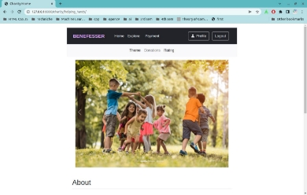
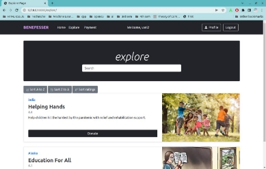
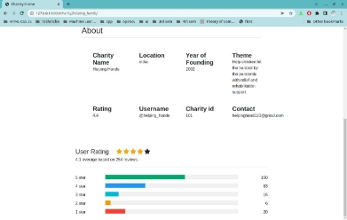
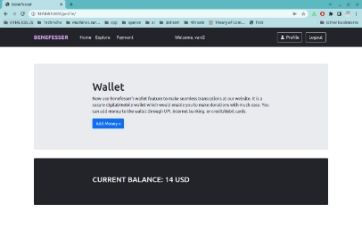
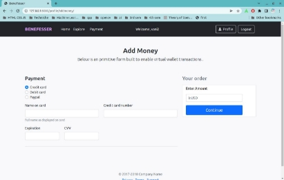

# Benefesser_deshaw_project
Building the framework for charity foundation. The aim of this project is to connect people who are willing to donate with the charities and NGOs in need. It lets donors know of the problems faced by unprivileged sections of the society and offers them easy access to some of the charity organizations where they can donate and track their donations. On the other hand, it facilitates the fund raising process for charities.

**Benefesser**

*Let charity and love prevail*

Junihers Group 4

Contents :

1. Executive Summary
1. Requirements
1. Design and Architecture
1. Snippets
1. Future Scope
1. References

Executive Summary :

In this project, we built the framework for the charity foundation.

The aim of this project is to connect people who are willing to donate with the charities and NGOs in need. It lets donors know of the problems faced by unprivileged sections of the society and offers them easy access to some of the charity organizations where they can donate and track their donations. On the other hand, it facilitates the fund raising process for charities.

The requirements of this project were to create the charity home page, user and charity registration - login, explore feature, rating review submission, wallet transactions interfaces.

//high level design

This gave us a developed charity management system where the NGOs can register themselves and users get an interface to make donations to the organizations which align with their interest. The project is a dummy money transaction and management system operation through the wallet feature which enables easy fund gathering opportunities for the charity.

We can make some improvements in the project which we weren't able to implement due to time constraints like linking of admin approval page to admin page, efficient storage of files in the database, sending email notifications to charities which would make the project more close to being used in real life.

Requirements :

A detailed description of various features intended to be built in project

1. User Registration : Donors can register themselves on the website
2. Charity Registration: Charities also register themselves by giving information on Certification requirement, Programs to invest in, Funds allocation/use, a portfolio/description page
2. Charity edit/update profile: To keep their profile updated with new programs or state of already existing ones.
2. Explore feature : Users can browse different charities and filter across different attributes like Location, Theme,cause etc and donate to them.
2. Review Feature: Users can share their experiences and reviews for certain ngos/charities they have visited, avg rating can be displayed of each charity.
2. Payment Wallet: Users can add money to the wallet and then donate to their favored charitable cause.
2. Logbook For Charity: Expense tracker for charity to keep track of donated funds and facilities/programs where the fund is used

Design and Architecture :

Used SQLite as a database management system provided by Django for maintaining backend operations.

Following relations tables exist in our schema:

1. Charity database
1. User database
1. User Balance database

The User Balance database is used to store the corresponding wallet balances of the users and has a foriegn key reference to the User database through username as Primary key.

Snippets :

Future Scope :

- While registering the Charity, we are asking for certificates to check the credibility of the organization, but due to constraints such as inefficient storage of files in the database, while getting the charity approval by the admin we are taking the link to the path of the file. This can be further modified to efficient storage of files in the database.
- Admin Approval Page can be linked to Admin login page.
- A separate email notification can be sent to the charities who have applied for the registration about their status of approval or rejection by the admin.
- Building a secure virtual wallet transaction feature which incorporates proper encoding and provides security.

References :

- [https://developer.thenewboston.com/tutorials/Back-End/d4b0f62f-7242-4812-ac47-8f268 d1f3c57](https://developer.thenewboston.com/tutorials/Back-End/d4b0f62f-7242-4812-ac47-8f268d1f3c57)
- [https://developer.thenewboston.com/tutorials/Back-End/d45aed95-7695-47a0-a26d-faf2 33e12dee](https://developer.thenewboston.com/tutorials/Back-End/d45aed95-7695-47a0-a26d-faf233e12dee)
